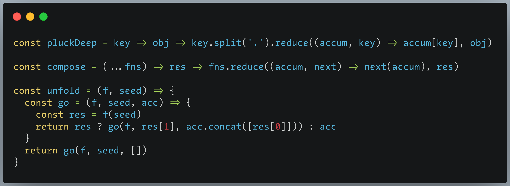

Best fonts for programming

## buy a 4k monitor for overcome your font addiction! 
## use the default font and get the f**king job done!
## Fonts
1. Aurulent: it looks like written by Lamy-pen, add missing glyphs from fira code;
2. Consolas: hinted,a better version for Windows 7, you need system font replacer tool;
3. Menlo: it's TheSans font, beautiful font for both screen and print, my favorite;
4. Droid Sans Mono: Android official monospace font, slashed zero. it is most legible font for reading IMO;
5. Source Code Pro: medium as regular, the medium looks like written by art fountain pen, the official default hint is really beautiful on Windows 7;
6. Fira Code: [most popular coding font](https://github.com/tonsky/FiraCode)
7. JuliaMono: [a font for math programming](https://github.com/cormullion/juliamono), it contains 8000+ glyphs, many math sign symbols;


Tips: 

1. only use the unhinted font when your monitor screen has high ppi(2K/4K monitor).

2. change the font name by [tools](https://github.com/chrissimpkins/fontname.py) if the font name conflict with system font.
usage:
```bash
python fontname.py "Monaco" Menlo-Regular.ttf
```

## Screenshots
Aurulent


Menlo



!!! The copyright of all these fonts belongs to their authors!
